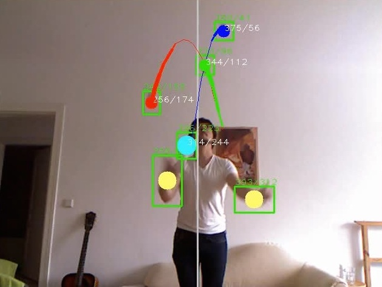
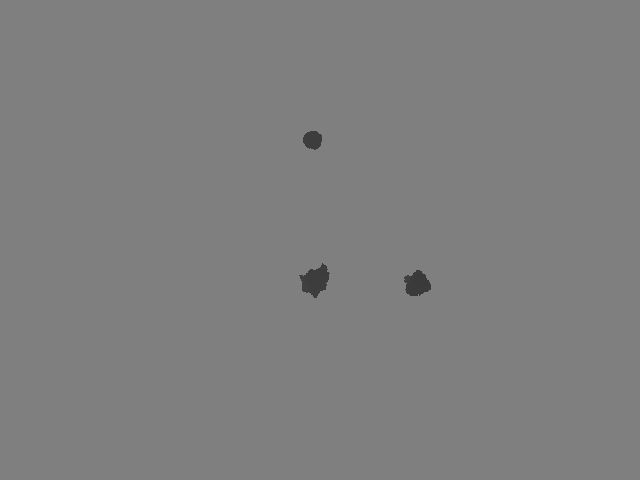
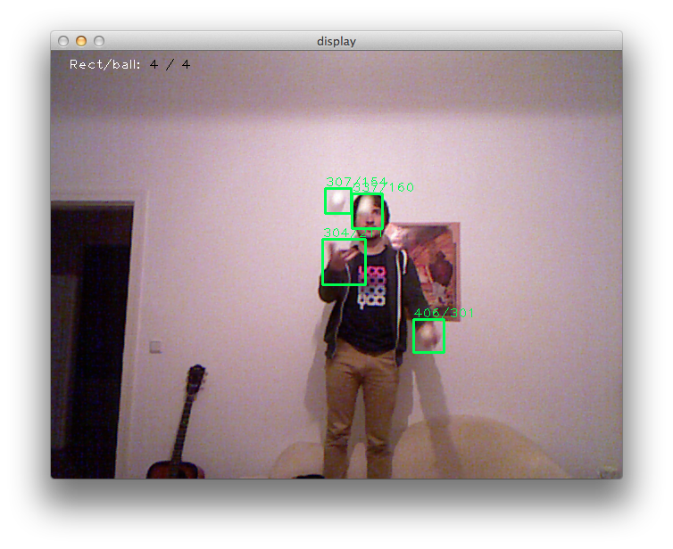
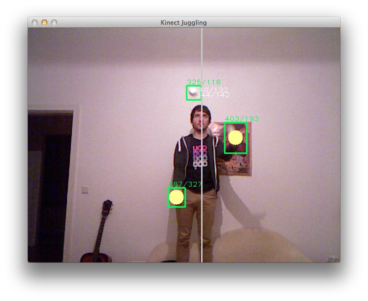
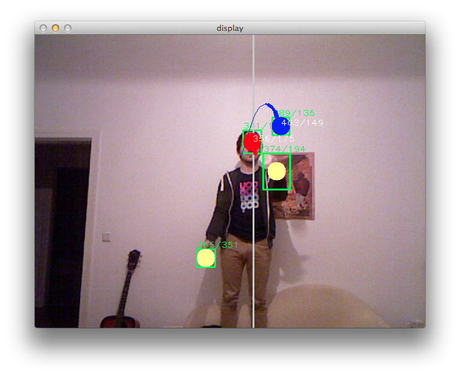
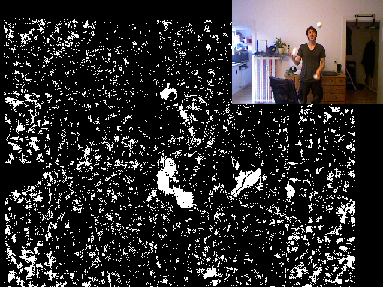
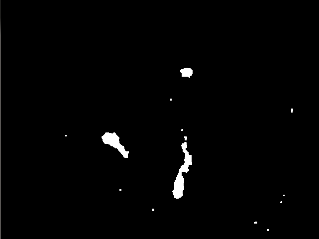
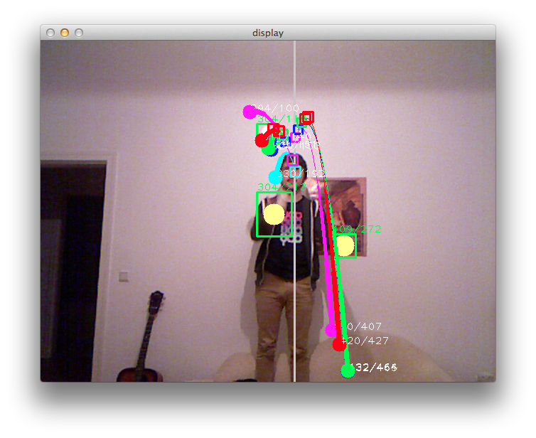

Jonglieren mit der Kinect
===

*Ein Ergebnis aus dem Masterprojekt Bildverarbeitung. Entwickelt von Rolf Boomgaarden, Thiemo Gries und Florian Letsch. Betreut von Benjamin Seppke.*

<https://github.com/florianletsch/kinect-juggling>

## Inhalt und Ergebnis

Die Microsoft Kinect ist ein Unterhaltungsgerät, das auch auch als Tiefendaten lieferndes System für wissenschaftliche Anwendungen verwendet werden kann.

Als Ergebnis unseres Projektes steht eine Anwendung, die mit Hilfe der Kinect Daten über ein Jongliermuster liefert. In Echtzeit werden die Tiefendaten vorverarbeitet, Positionen von Bällen und Händen erkannt und in Bildfolgen einander zugeordnet. Die erkannten Flugbahnen werden auf dem Videobild eingezeichnet.

## Hintergrund: Was kann die Kinect?

Die Kinect ist eine von Microsoft zur Spielekonsole Xbox 360 vertriebene Erweiterung, die den Spieler mit einem RGB- und einem Tiefensensor erfasst und diese beiden Datenströme an die Konsole liefert. Diese *Kamera* liefert standardmäßig 30 Bilder pro Sekunde mit einer Auflösung von 640x480 und 8 Bit Farbtiefe. Die Tiefendaten stammen von einer Infrarot-Kamera und liefern 2048 verschiedene Tiefenwerte (11bit).

## Bildverarbeitende Schritte

Je nach Aufrufparametern können verschiedene Verarbeitungsschritte in Form von Filtern miteinander kombiniert werden.
So führt der Aufruf `python main.py --detectball --cutoff  --handtracking --simplehand` zu folgendem Ablauf für jeden einzelnen Frame.

### 1. Binarisieren der Tiefendaten

Die rohen Tiefendaten der Kinect werden binarisiert, also in Vordergrund (weiß) und Hintergrund (schwarz) aufgeteilt. Der Vordergrund besteht dann aus Pixel-Flächen mit Jonglierbällen und Händen des Jongleurs.

### 2. Kandidaten für Hand- und Ball-Positionen erfassen

Alle weißen Flächen, die eine Mindestgröße erfüllen und in der Bildmitte liegen, werden von Rechtecken umzeichnet (Bounding Boxes). Die Mittelpunkte dieser Rechtecke werden als Liste von möglichen Ball- und Handpositionen erfasst.

### 3. Hände erkennen

An Hand aller erkannten Positionen wird die Mittelachse des Jongliermusters erkannt. Die Hände werden erkannt als die jeweils tiefste Position auf beiden Seiten der Mittelachse.

### 4. Bälle erkennen

Für jede potentielle Ballposition wird getestet, ob in naher Umgebung bereits ein Ball aus dem vorherigen Frame bekannt ist. Ist dies der Fall, wird die Position der existierenden Ball-Instanz aktualisiert. Wenn nicht, initialisiere eine neue Ball-Instanz an dieser Position.

### 5. Visualisierung

Für die Darstellung werden eingezeichnet:

- Handpositionen (gelbe Kreise)
- Ball-Instanzen mit vergangener Flugbahn (mehrere Farben)
- Mittelachse des Jongliermusters (graue Linie)

## Features

- Erkennen der Flugbahnen mehrerer Jonglierbälle in Echtzeit
- Keine feste Ballanzahl vorgebeben (Getestet mit 2, 3, 4 und 5 Bällen im Bild)
- Ermittelung der aktuell jonglierten Ballanzahl
- Kombination verschiedener Filter über Kommandozeilenparameter erlaubt flexibles Testen
- Arbeit an Live-Daten oder aufgezeichneten Demodaten möglich

## Anwendungsmöglichkeiten

Die entwickelte Software wertet die Rohdaten der Kinect aus und liefert Positionsdaten über erkannte Jonglierbälle und die Hände eines Jongleurs in Bildfolgen. Dies alles passiert in Echtzeit. Mit diesen Daten sind vielerlei Anwendungen denkbar:

- Erweiterte Analyse von Jongliermustern (Siteswaps!)
- Jonglier-Trainer
- Jonglier-Spiele

## Technisches

Entwickelt haben wir die Anwendung in Python und die `libfreenect` Library des OpenKinect Projekts verwendet, um mit der Kinect zu sprechen.

Weitere verwendete Bibliotheken: NumPy, OpenCV und PIL.

Der Quellcode steht unter der MIT Lizenz frei zu Verfügung unter <https://github.com/florianletsch/kinect-juggling>

## Weitere Ansätze und Experimente

Variable Position des Jongleurs und Robustheit gegenüber Hindernissen im Bild.
Idee: Bälle definieren Regionen maximaler Bewegung zwischen zwei Frame. Probleme:
Rauschen, Verlust der Kreisform.

---
Rauschen Entfernen durch FIXME:

---
Ballerkennung verbessern durch Approximation der Flugbahnen:

